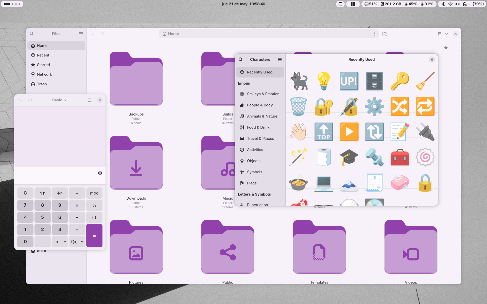
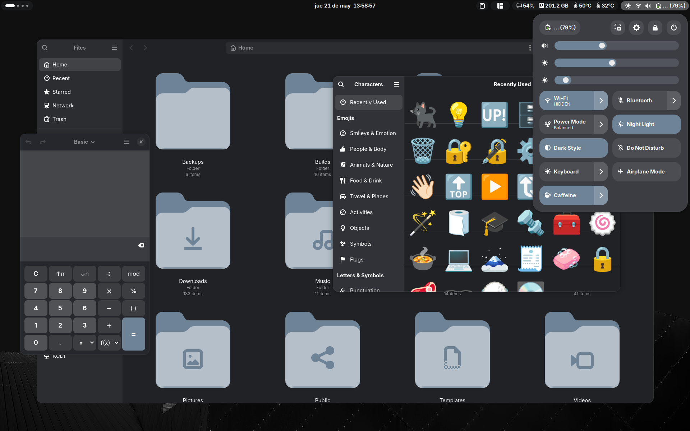

# Atiawda Gnome Shell theme

## Screenshots





## Installation

**Requirements**

- GNOME 50
- [User Themes](https://extensions.gnome.org/extension/19/user-themes) extension

1. Open the terminal.

2. Clone the repository:

```bash
git clone https://github.com/axolotl13/atiawda.git
cd atiawda
```

3. Run the installation script (root privileges may be required):

```bash
chmod +x install.sh
./install.sh
```

4. Logout for changes to take effect.

## Uninstallation

```bash
./install.sh restore
```
